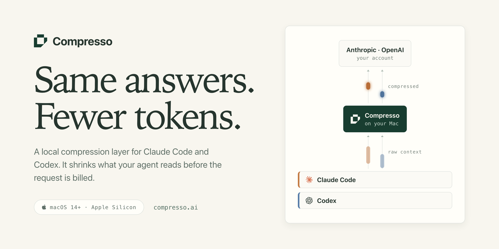
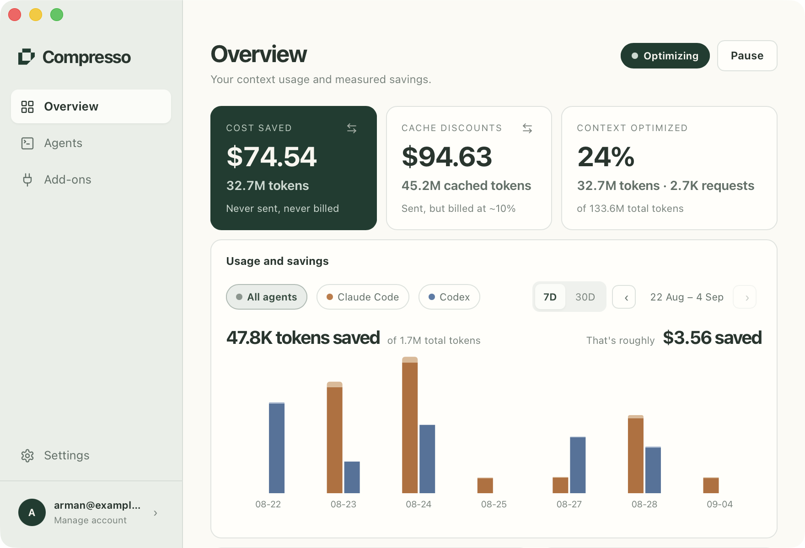
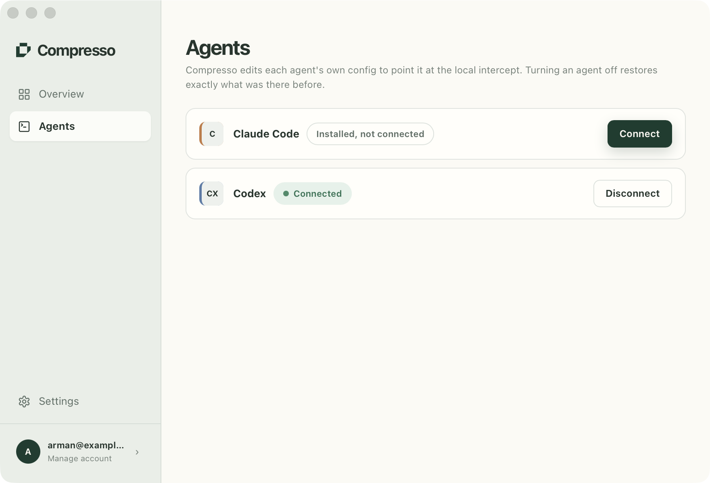
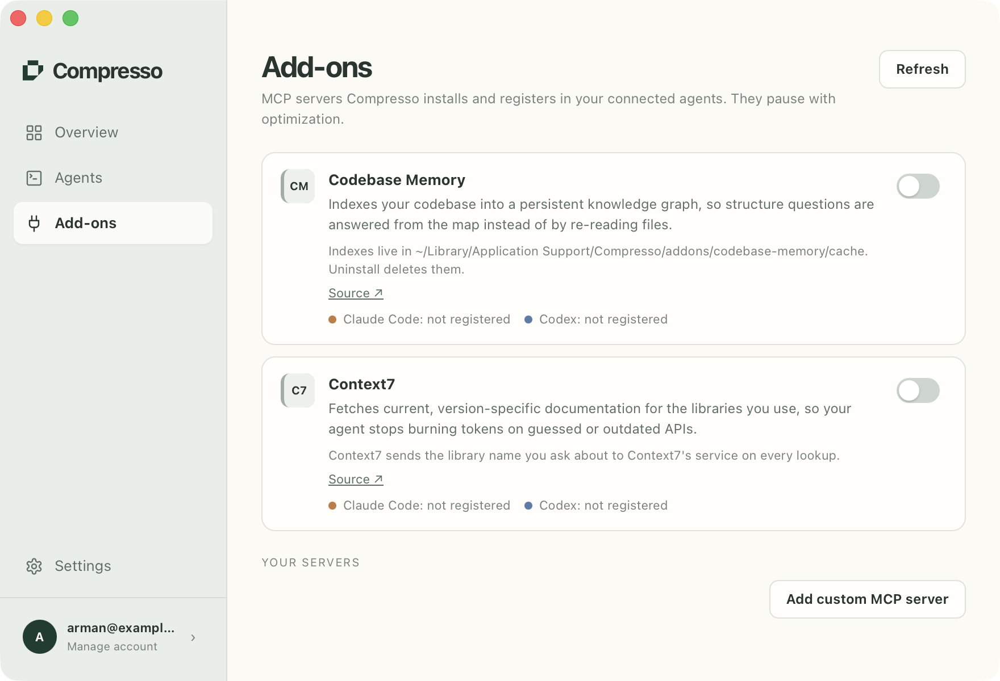

<a href="https://compresso.ai">
  <picture>
    <source media="(prefers-color-scheme: dark)" srcset="docs/hero-dark.png">
    
  </picture>
</a>

# Compresso

**Cut Claude Code and Codex token costs. Local-first. Honest numbers.**

Compresso is a macOS menu-bar app that runs a local compression layer between your AI coding agents and their providers. It compresses the tool output, logs, files and history that bloat every request, before the request is billed. Your prompts never leave your Mac.

## What it does

Your agent talks to a loopback port on your Mac instead of talking to the provider directly. Compresso compresses what it finds in the request, then forwards it to Anthropic or OpenAI under your own credentials.

It compresses; it does not summarize, and it does not drop messages. Every message stays where it is and what shrinks is the contents, so the model sees the same conversation with less of it spent on repetition. Structured, repetitive machine output is where the slack lives: JSON, shell output, build logs. Source code is routed straight through untouched.

Full pipeline: [how it works](https://compresso.ai/how-it-works).

<picture>
  <source media="(prefers-color-scheme: dark)" srcset="docs/app-overview-dark.png">
  
</picture>

## Features

- **Cache discounts survive.** The start of each request stays byte-identical from turn to turn, so the provider's cache discount still applies, and it is counted apart from the tokens that were never sent at all.
- **One click per agent.** Compresso finds the agents you already have, points each at the local intercept, and puts its config back exactly as it was when you disconnect.
- **Add-ons.** MCP servers, Codebase Memory and Context7 or one you name yourself, installed and registered into every connected agent with one switch, and removed again when you switch them off.
- **Numbers you can check.** Token counts are measured. Dollar figures are marked as estimates, and the two are never blended into one headline.
- **Out of the way when it matters.** Pause without disconnecting, and if the engine is down or your subscription lapses, requests pass straight through rather than failing.

## Install

Requires macOS 14 (Sonoma) or later on Apple Silicon.

1. Download the `.dmg` from the [latest release](https://github.com/armanzeroeight/compresso/releases/latest)
2. Open it and drag **Compresso** to Applications
3. Launch it. It appears in your menu bar and walks you through connecting Claude Code and Codex.

Every release is code-signed and notarized by Apple, so macOS opens it without Gatekeeper warnings, and each one carries a signed auto-update manifest that keeps the app current after the first install.

## What it never does

This is the part worth reading twice. Each item is enforced in code, not promised in marketing copy.

- **Your prompts and code never reach our servers.** Compression runs entirely on your Mac. Requests go from your agent, through a local loopback port, straight to Anthropic or OpenAI. Our servers never see a prompt, a file, or a line of your code.
- **Your credentials are never collected, stored, or logged.** The `Authorization` header is copied through byte for byte. It is read in exactly one place, on your Mac, in memory, for one purpose: working out which Claude or ChatGPT plan you are on, so the app can offer the tier that matches. The request type used for routing and counting has no field that could hold a credential. Compresso never touches the credential files your tools keep on disk.
- **Only aggregate counters leave your machine.** Tokens before, tokens after, tokens saved, request counts, per agent, per day, plus your account email and device registration. No prompts, no code, no file names, no payloads. Every field is listed in the [privacy policy](https://compresso.ai/privacy).
- **It binds to loopback only.** A non-loopback `Host`, or any `Origin` at all, gets a 403.
- **It rewrites exactly one header.** On the direct-to-upstream path, `Host`, so TLS SNI lines up. The body is forwarded byte for byte.
- **It never edits your shell config or PATH.** Config files it does write get a timestamped backup and an atomic replace, and a file that failed to parse is never written back.
- **Uninstall shows its work.** It lists everything it will remove before it runs, and restores every config it changed.

More detail: [trust and security](https://compresso.ai/security).

### Fail-open by design

If the compression engine is down, still starting, or your subscription lapses, requests pass straight through to the provider unmodified, in under a second, with no dead port. Quitting the app does not break your agents either; a background helper keeps the port answering.

One thing worth knowing rather than discovering: passing through unmodified means passing through *uncompressed*. If you normally run close to your provider's rate limit, the compressed request is part of what keeps you under it, and the raw one may not fit. Compresso stops optimizing; it does not promise your provider will keep saying yes.

## Benchmarks

None of these numbers are measured by this repo. They are the open-source `headroom` engine's published benchmark runs (engine `0.5.18`), transcribed without rounding in our favor. The rows that saved nothing are in the table because they are real results.

### By content type

| Content | Original | Compressed | Saved | Latency |
|---|---:|---:|---:|---:|
| Build log (200 lines) | 2,412 | 148 | **93.9%** | 1ms |
| JSON array (100 items) | 3,163 | 297 | **90.6%** | 1ms |
| Shell output (200 lines) | 3,238 | 469 | **85.5%** | 1ms |
| JSON array (500 items) | 9,526 | 1,614 | **83.1%** | 2ms |
| grep results (150 hits) | 2,624 | 2,624 | 0.0% | <1ms |
| Python source (~480 lines) | 2,958 | 2,958 | 0.0% | <1ms |
| **Total** | **23,921** | **8,110** | **66.1%** | **5ms** |

The last two rows are the point. The router looked at source code and grep hits and passed them through exactly as they arrived.

### On whole agent tasks

| Workload | Before | After | Saved |
|---|---:|---:|---:|
| SRE incident debugging | 65,694 | 5,118 | 92.2% |
| Code search | 17,765 | 1,408 | 92.1% |
| GitHub issue triage | 54,174 | 14,761 | 72.8% |
| Codebase exploration | 78,502 | 41,254 | 47.5% |

### In production, across 50,000+ real sessions

**Median session: 4.8%.** P75: 6.9%. Mean: 11.3%.

That median is low because a real session is mostly things that do not compress, and the mean is dragged up by the sessions full of tool output. Both numbers are published on purpose. If your work is heavy on logs, test output and API responses, you live in the right-hand tail; if you mostly write prose to a model, you do not, and you should know that before you pay.

Accuracy under compression, the full methodology, and the latency costs are all on [compresso.ai/benchmarks](https://compresso.ai/benchmarks). Upstream source: [headroomlabs-ai.github.io/headroom/benchmarks](https://headroomlabs-ai.github.io/headroom/benchmarks/).

## Pricing

Five-day free trial, no card up front. After that, a tier that matches the plan you already pay for:

| Tier | Covers | Monthly |
|---|---|---:|
| Pro | Claude Pro, ChatGPT Plus | $4 |
| Max 5x | Claude Max 5x, ChatGPT Pro | $15 |
| Max 20x | Claude Max 20x, ChatGPT Pro 20x | $30 |

Every tier includes everything, up to 2 Macs per account. Yearly billing and an introductory discount are on [compresso.ai/pricing](https://compresso.ai/pricing). Billing is handled by Polar as merchant of record, so card details never reach us. You subscribe inside the app, not on the website.

<picture>
  <source media="(prefers-color-scheme: dark)" srcset="docs/app-agents-dark.png">
  
</picture>

<picture>
  <source media="(prefers-color-scheme: dark)" srcset="docs/app-addons-dark.png">
  
</picture>

## Questions

**Which agents are supported?**
Claude Code and Codex today. The intercept is agent-agnostic at the protocol level, so more agents are a product decision rather than a rewrite.

**Does it work with Claude Pro/Max and ChatGPT plans, or do I need an API key?**
Both work. Subscription traffic has no per-token price, so Compresso reports room against your plan's limits rather than an invented dollar figure. Dollar estimates appear only for API-key traffic, where there is a real rate to price against.

**Can I trust the savings numbers?**
Token counts are measured, not estimated. Dollar figures are always marked as estimates and never blended with the measured counts.

**Is the engine open source?**
Yes. Compresso runs the open-source `headroom` engine (Apache-2.0), fetched at first launch and run entirely on your machine. Downloads are integrity-checked, and a checksum mismatch is a hard failure rather than a warning.

**What happens when my trial or subscription ends?**
Requests pass straight through to Anthropic or OpenAI, uncompressed. Nothing is uninstalled and no port goes dead.

**How many Macs can I use?**
Two per account.

Full list: [compresso.ai/faq](https://compresso.ai/faq).

## Support

- **Bugs in a release:** [open an issue](https://github.com/armanzeroeight/compresso/issues/new/choose)
- **Questions and ideas:** [Discussions](https://github.com/armanzeroeight/compresso/discussions)
- **Account, billing, or anything private:** [compresso.ai/faq](https://compresso.ai/faq)

## What is in this repository

Release artifacts, changelogs, and the auto-updater manifests the app consumes (`latest.json`). The application source is developed privately; this repo is the distribution and release-notes surface.

- [Changelog](CHANGELOG.md)
- [All releases](https://github.com/armanzeroeight/compresso/releases)

## License

The Compresso app is proprietary software; downloading a release does not grant rights to redistribute or reverse engineer it. The `headroom` compression engine it runs is separately licensed under Apache-2.0 by its own authors.

Compresso is an independent project and is not affiliated with Anthropic or OpenAI. "Claude Code" and "Codex" are their respective owners' names for their own products.
